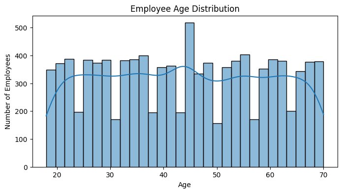
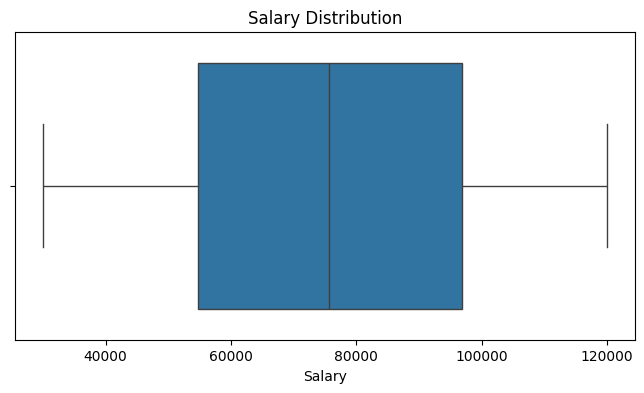
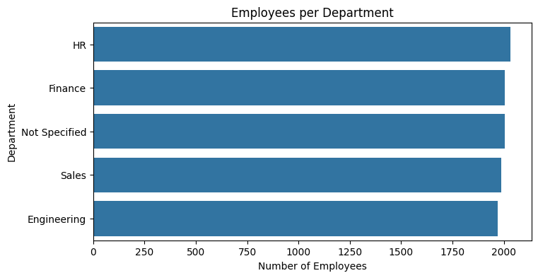
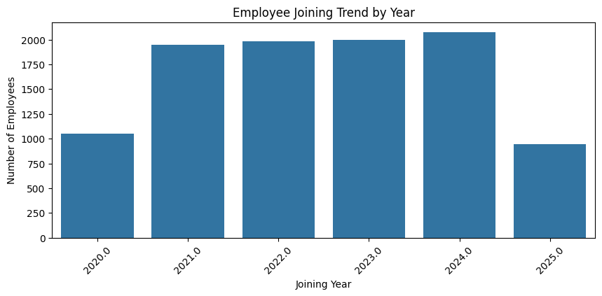

# HR Analytics — Data Cleaning & Exploratory Analysis

## 📌 Project Overview

This project focuses on cleaning and analyzing an HR dataset containing approximately 10,000 employee records with intentional data-quality issues.

The objective was to transform the raw dataset into a reliable dataset for HR analysis and explore workforce demographics, salary distribution, departmental composition, and employee joining trends.

---

## 🎯 Business Problem

HR teams rely on accurate employee data for workforce planning, reporting, and decision-making. However, missing, invalid, or inconsistent records can lead to unreliable analysis.

The dataset contained several data-quality issues, including:

- Missing employee information
- Placeholder values such as `unknown`
- Invalid email values
- Unrealistic age values
- Negative salary values
- Missing department and remarks
- Invalid joining dates
- Potential salary outliers
- Duplicate records

The goal was to identify these issues, apply appropriate data-cleaning rules, validate the resulting dataset, and perform exploratory analysis.

---

## 🛠️ Tools & Technologies

- Python
- Pandas
- NumPy
- Matplotlib
- Seaborn
- Jupyter Notebook

---

## 🔍 Data Cleaning Process

### 1. Data Quality Assessment

The dataset was profiled to identify:

- Missing values
- Duplicate records
- Placeholder values
- Invalid numerical values
- Inconsistent categorical fields
- Invalid dates

### 2. Duplicate Records

The dataset contained **197 duplicate records**.

These duplicate rows were identified and removed before further analysis.

### 3. Email Cleaning

Placeholder and invalid email values such as `unknown` and `not_an_email` were converted to missing values.

Email values were not artificially imputed because an employee's actual email address cannot be reliably inferred from other fields.

### 4. Age Cleaning

Age values were converted to numeric format.

Values outside the valid employee range of **18–70 years** were treated as invalid.

Missing and invalid ages were then imputed using the **median age**, as the median is less sensitive to extreme values.

### 5. Salary Cleaning

Salary values were converted to numeric format.

Negative salaries were treated as invalid and converted to missing values.

The salary distribution was examined before imputation. The skewness was approximately **-0.056**, indicating a relatively symmetric distribution, and the mean and median were reasonably close.

Therefore, missing salary values were imputed using the **mean salary**.

The **IQR method** was then used to identify potential salary outliers. No salary observations fell outside the calculated IQR boundaries after invalid salary values were handled, so no additional outlier treatment was required.

### 6. JoinDate Cleaning

Joining dates were converted into datetime format.

Invalid date values were converted to `NaT`.

The invalid dates were not artificially filled because the correct joining date could not be reliably inferred from the available data.

### 7. Department & Remarks

Missing department values were replaced with `Not Specified`.

Missing remarks were replaced with `No Remarks`.

---

## 📊 Exploratory Data Analysis

The cleaned dataset was analyzed using Matplotlib and Seaborn.

### Employee Age Distribution

The age distribution was examined to understand the demographic composition of the workforce.

### Salary Distribution

Salary distribution was analyzed using a boxplot and descriptive statistics.

### Department Distribution

Employee counts were compared across departments.

### Employee Joining Trend

Employee joining trends were analyzed from 2020 through 2025.

---

## 💡 Key Business Insights

- The workforce was relatively evenly distributed across the specified departments, with **HR having the highest employee count (2,034)** and **Engineering the lowest (1,971)**.

- Approximately **20% of employee records had no department specified**, highlighting a data-quality gap that could affect department-level workforce planning and reporting.

- Salary data was relatively symmetric, with skewness close to zero and mean and median values being reasonably close.

- No salary observations fell outside the IQR-based outlier boundaries after invalid salary values were handled.

- Employee joining counts increased steadily from **2021 through 2024**, with **2024 recording the highest full-year joining count (2,072)**.

- The 2025 joining count should not be interpreted as a decline in hiring because the dataset only contains records through **June 21, 2025**.

---

## 📁 Project Files

| File | Description |
|---|---|
| `HR_Analytics_Data_Cleaning.ipynb` | Complete Python data cleaning and exploratory analysis |
| `HR_Analytics_Cleaned.csv` | Final cleaned HR dataset |
| `images/` | Visualizations generated during exploratory analysis |

---

## 📚 Skills Demonstrated

- Data Cleaning
- Data Quality Assessment
- Missing Value Handling
- Data Validation
- Duplicate Detection
- Outlier Detection using IQR
- Statistical Reasoning
- Exploratory Data Analysis
- Data Visualization
- Python
- Pandas
- NumPy
- Matplotlib
- Seaborn

---

## 🔗 Dataset Source

Original dataset:

https://github.com/swapnilsaurav/projects

The dataset was independently cleaned, validated, and analyzed using Python.
